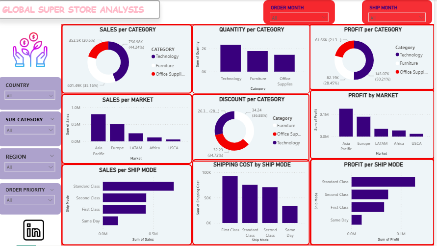

# Global Superstore Sales Analysis

## Overview

This repository contains a comprehensive analysis of the Global Superstore dataset, which includes sales records from various regions, product categories, and customer segments. The project aims to analyze sales performance, identify key trends, and derive actionable business insights to inform strategic decisions.

## Dataset Description

The Global Superstore dataset consists of transactional data from a fictional superstore chain, containing over 10,000 sales records spanning multiple years. The dataset includes:

- **Rows**: Over 10,000 entries
- **Columns**: 21 attributes covering all aspects of sales transactions
- **Time Period**: Multi-year sales data

### Key Columns:
- `Row ID`: Unique identifier for each transaction
- `Order ID`: Identifier for grouped items in an order
- `Order Date` & `Ship Date`: Timestamps for ordering and shipping
- `Ship Mode`: Delivery method (First Class, Second Class, Standard Class, Same Day)
- `Customer Information`: ID, Name, Segment (Consumer, Corporate, Home Office)
- `Geographic Data`: City, State, Country, Region, Market
- `Product Details`: Category, Sub-Category, Product Name
- `Financial Metrics`: Sales, Quantity, Discount, Profit, Shipping Cost
- `Order Priority`: Urgency level (Critical, High, Medium, Low)

## Repository Structure

- [GLOBALSUPERSTORE_DATA.csv](file:///c:/Users/Lenovo/Desktop/APPS_N_FULL-PROJECTS/GLOBALSUPERSTORE_PROJECT/GLOBALSUPERSTORE_DATA.csv): Main dataset file containing all sales records
- [GLOBALSUPERSTORE_DATA%20-DUPLICATE1.csv](file:///c:/Users/Lenovo/Desktop/APPS_N_FULL-PROJECTS/GLOBALSUPERSTORE_PROJECT/GLOBALSUPERSTORE_DATA%20-DUPLICATE1.csv): A duplicate/cleaned version of the dataset
- [GLOBALSUPERSTORE_INITIAL.ipynb](file:///c:/Users/Lenovo/Desktop/APPS_N_FULL-PROJECTS/GLOBALSUPERSTORE_PROJECT/GLOBALSUPERSTORE_INITIAL.ipynb): Initial exploratory data analysis notebook
- [GLOBALSUPERSTORE_FINAL.ipynb](file:///c:/Users/Lenovo/Desktop/APPS_N_FULL-PROJECTS/GLOBALSUPERSTORE_PROJECT/GLOBALSUPERSTORE_FINAL.ipynb): Final comprehensive analysis notebook
- [GLOBALSUPERSTORE.md](file:///c:/Users/Lenovo/Desktop/APPS_N_FULL-PROJECTS/GLOBALSUPERSTORE_PROJECT/GLOBALSUPERSTORE.md): Original project documentation
- [GLOBALSUPERSTORE_PB.pbix](file:///c:/Users/Lenovo/Desktop/APPS_N_FULL-PROJECTS/GLOBALSUPERSTORE_PROJECT/GLOBALSUPERSTORE_PB.pbix): Power BI visualization file
- [GLOBALSUPERSTORE_QUIZ.pdf](file:///c:/Users/Lenovo/Desktop/APPS_N_FULL-PROJECTS/GLOBALSUPERSTORE_PROJECT/GLOBALSUPERSTORE_QUIZ.pdf): Assessment document related to the project

## Dashboard Image


This dashboard provides an interactive view of key sales metrics, including sales, quantity, profit, discount, and shipping cost across categories, markets, and ship modes. Filters on the left allow users to explore data by country, sub-category, region, and order priority.

## Analysis Objectives

1. **Data Cleaning and Preparation**
   - Load the dataset into analysis tools
   - Identify and handle missing or duplicate data
   - Ensure appropriate data types for analysis

2. **Descriptive Statistics**
   - Calculate summary statistics for numerical columns (mean, median, standard deviation of Sales and Profit)
   - Determine distributions of categorical variables (count of orders by Region, Category)

3. **Data Visualizations**
   - Create visualizations representing sales trends over time
   - Develop bar charts showing sales and profit by Category and Sub-Category
   - Use geographical maps to display sales performance across regions and states

4. **Customer Analysis**
   - Identify top 10 customers based on total sales
   - Analyze purchasing patterns across different customer segments

5. **Product Performance**
   - Determine best and worst selling products
   - Analyze the impact of discounts on sales and profitability

6. **Shipping Analysis**
   - Evaluate delivery time by calculating differences between Order Date and Ship Date
   - Analyze how Ship Mode affects delivery time and customer satisfaction

## Technical Requirements

To run the analysis notebooks, you'll need:

- Python 3.x
- Jupyter Notebook
- Libraries:
  - pandas
  - numpy
  - matplotlib
  - seaborn
  - plotly
  - scipy (optional, for advanced statistics)

## Setup Instructions

1. Clone this repository:
   ```
   git clone https://github.com/yourusername/globalsuperstore-project.git
   cd globalsuperstore-project
   ```

2. Install required packages:
   ```
   pip install pandas numpy matplotlib seaborn plotly jupyter
   ```

3. Open and run the Jupyter notebooks:
   ```
   jupyter notebook
   ```

4. Start with [GLOBALSUPERSTORE_INITIAL.ipynb](file:///c:/Users/Lenovo/Desktop/APPS_N_FULL-PROJECTS/GLOBALSUPERSTORE_PROJECT/GLOBALSUPERSTORE_INITIAL.ipynb) for initial exploration, then proceed to [GLOBALSUPERSTORE_FINAL.ipynb](file:///c:/Users/Lenovo/Desktop/APPS_N_FULL-PROJECTS/GLOBALSUPERSTORE_PROJECT/GLOBALSUPERSTORE_FINAL.ipynb) for comprehensive analysis.

## Key Findings

Based on the analysis performed in the notebooks, some preliminary findings include:

- **Regional Performance**: Certain regions consistently outperform others in both sales volume and profitability
- **Seasonal Trends**: Clear seasonal patterns emerge in sales, with peak periods aligning with holiday seasons
- **Product Categories**: Technology and Furniture categories show different performance characteristics
- **Customer Segments**: Corporate customers contribute significantly to revenue despite fewer transactions
- **Discount Impact**: Relationship between discount levels and sales volume/profitability

## Business Insights

- Optimize inventory based on regional demand patterns
- Adjust discount strategies to maximize profitability
- Focus on high-value customer segments
- Improve shipping efficiency for better customer satisfaction
- Leverage seasonal trends for marketing campaigns

## Visualization Tools

The repository includes both Jupyter notebook visualizations and a Power BI dashboard ([GLOBALSUPERSTORE_PB.pbix](file:///c:/Users/Lenovo/Desktop/APPS_N_FULL-PROJECTS/GLOBALSUPERSTORE_PROJECT/GLOBALSUPERSTORE_PB.pbix)) for interactive exploration of the data.

## Contributing

If you'd like to contribute to this project:

1. Fork the repository
2. Create a feature branch
3. Make your changes
4. Submit a pull request with a detailed explanation of your modifications

## License

This project is open source and available under the [MIT License](https://opensource.org/licenses/MIT).

## Acknowledgements

- The Global Superstore dataset is a commonly used educational dataset for learning data analysis techniques
- Inspired by real-world business analytics challenges
- Thanks to the open-source community for the tools and libraries that made this analysis possible"# GLOBALSUPERSTORE_PROJECT" 
